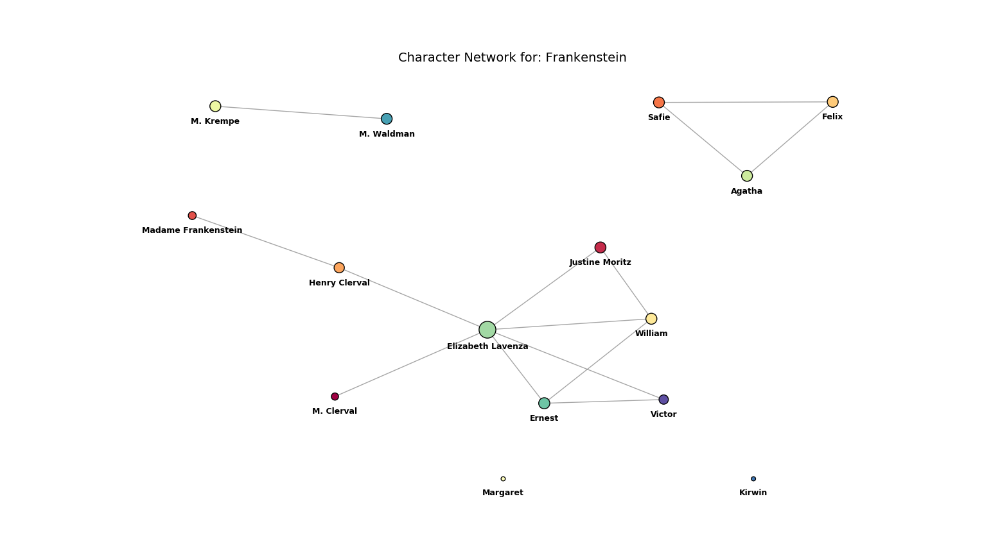

# char_net

### Quick Start

char_net is a group final project for PIC 16 at UCLA by Christina Indudhara and Ignat Kulinka.
This project aims to extract the names of characters from .txt novels
 using the [Stanford NER Tagger](https://nlp.stanford.edu/software/CRF-NER.html).
 The repository has examples of the networks produced for _Frankenstein_, 
 _The Adventures of Sherlock Holmes_, and _Harry Potter 7 - Deathly Hollows_
 
### Usage

The project was designed to be reused as a module within Python. This can be 
done by importing the `FinalNLTKProj.py` file. The `testNLTKmodule.py` is 
a documented example of how to use the project.

### Sourcing Novels

[Project Gutenberg](http://www.gutenberg.org/) is a great source of novels in
easy to use and convert formats.

### Examples

